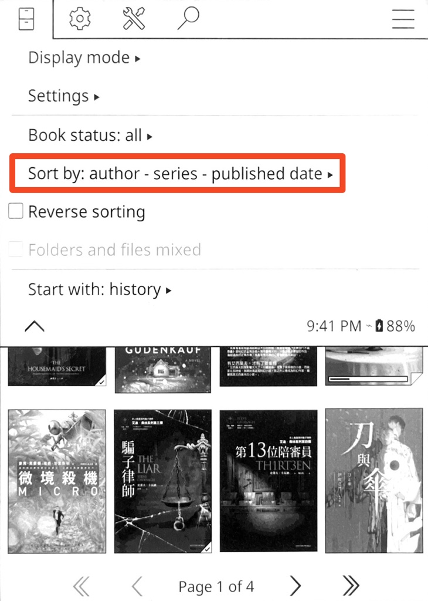

<a href="https://www.buymeacoffee.com/chiahsien" target="_blank"></a>

# KOReader Sort by Author-Series Patch

A user patch for KOReader that adds four new sorting options to the file browser, organizing books by author, series, and then by title or published date.

## Features

- Four sorting modes combining author name order and fallback sorting:
  - Author (first name) - Series - Title
  - Author (last name) - Series - Title
  - Author (first name) - Series - Published Date
  - Author (last name) - Series - Published Date
- "Last name" mode rewrites "John Doe" -> "Doe, John" for sort ordering; names already in "Last, First" format are left unchanged
- Books in the same series are ordered by series index when available
- Falls back to title (or published date) when author and series are identical
- Books with missing metadata are sorted last
- Fully compatible with existing KOReader sorting options

## How It Works

### Sort Order

Each sorting mode applies the following comparisons in order:

1. **Author** -- locale-aware string comparison (`strcoll`), using either first-name or last-name ordering
2. **Series** -- locale-aware string comparison
3. **Series index** -- numeric comparison; books with an index sort before those without
4. **Fallback** -- either title or published date (depending on the selected mode), with title as the final tiebreaker

### Author Name Modes

- **First name**: Uses the author name as-is from book metadata (e.g., "John Doe")
- **Last name**: Rewrites "John Doe" -> "Doe, John" by treating the last word as the surname. Names already containing a comma are left unchanged.

### Display Format

Each book's subtitle line shows available metadata separated by bullets:

```
Author • Series #Index • Published Date
```

Fields with missing metadata are omitted rather than showing placeholders.

## Installation

### Steps

1. Download the patch file `2-sort-by-author-series.lua` from this repository.
2. Locate your KOReader patches directory:
   - Usually: `<koreader_data_dir>/patches/`
   - Common paths:
     - Kobo: `/mnt/onboard/.adds/koreader/patches/`
     - Kindle: `/mnt/us/documents/koreader/patches/`
     - Android: `/sdcard/koreader/patches/` (or app-specific storage)
     - Desktop: `~/.koreader/patches/`
3. Copy the patch file to the patches directory.
4. Restart KOReader -- the patch will be loaded automatically on startup.

## Usage

1. Open the file browser and tap the "Sort by:" menu item.
2. Select one of the four "author - series" sorting options.
3. Books are sorted by author, then series, then title or published date.
4. If published date is missing, the date modes fall back to sorting by title.



## Limitations

- The last-name rewriting assumes the final word is the surname. This produces incorrect results for compound surnames (e.g., "Gabriel Garcia Marquez"), name suffixes ("Jr.", "III"), and name orders where the family name comes first (e.g., Chinese, Japanese, Korean names).
- Only the first author is used for sorting when multiple authors are present in a single metadata field.

## Related Resources

- [KOReader Documentation](https://github.com/koreader/koreader/wiki)
- [KOReader User Patches](https://github.com/koreader/koreader/wiki/Userpatch)
